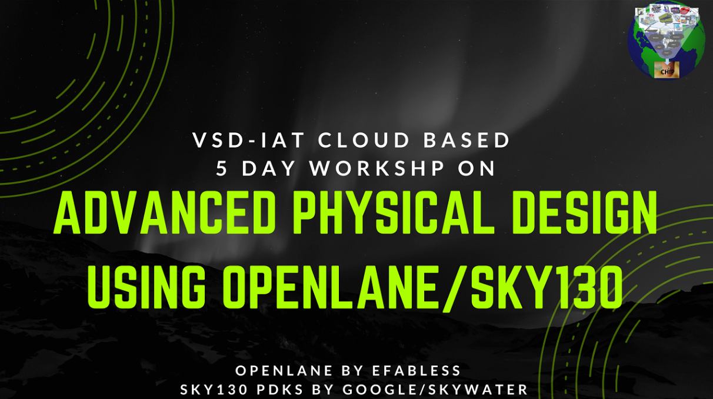
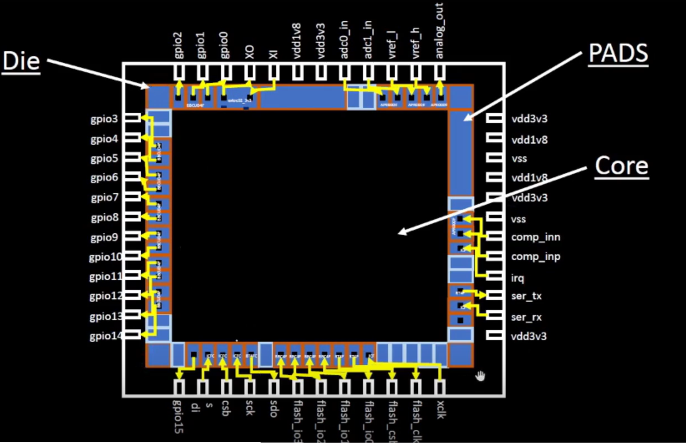

# **Advance Physical Design using OpenLANE and SkyWater 130nm PDK**

This repository aims to capture the works done in 5-day workshop of Adavance Physical Design using OpenLANE/SkyWater130. The workshop helps to familiarise with the efabless OpenLANE VLSI design flow RTL2GDS and the Skywater 130nm PDK. OpenLANE is an open source VLSI flow built around open source tools with the goal to produce clean GDSII with no human intervention("no human in the loop"). PicoRV32 is a CPU core that implements the RISC-V RV32IMC Instruction Set which is used as an example in this course.

## **Day 1**
- Introduction to IC Design components and terminologies:

    
