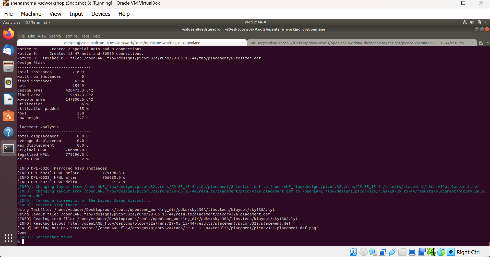

# **Advance Physical Design using OpenLANE and SkyWater 130nm PDK**


**Day-1**

-Introduction to IC Design Components and Terminologies:

- Core- A core is an area in the chip where the fundamental logic of the design is placed. It encapsulates all the combinational circuit, soft and hard IPs, and nets.
- Die- Die is an area of the chip that encapsulates the core and IO pads. Die is imprinted multiple times along the silicon area or wafer to increase the throughput.
- IO pads- IO pads are the pins that act as the source of communication between core and the outside world. Pad cells surround the rectangular metal patches where external bonds are made. Input, output and power pad.


- IPs- Foundary IPs are manually designed or need some human interference (or intelligence) essentially to define and create them like SRAM, ADC, DAC and PLLs.
- PDKs- PDKs are interface between foundary and design engineers. PDKs contains set of files to model fabrication process for the design tools used to design IC like device models, DRC, LVS, Physical extraction, layers, LEF, standard cell libraries, timing libraries etc. SkyWater 130nm is the PDK used in this workshop specifically sky130_fd_sc_hd and openLANE is built around this PDK.

-Software Application to Hardware Execution:

Applications and softwares running in PCs and laptops are implemented in languages like C, C++, Python, Java, .NET etc. These applications needs to be converted into bitstream using the compiler and assembler which is understandable by the core. Compilers are used to generate bitstream based on Instruction Set Architecture of the native processor. The core is implemented using HDL.

-RTL2GDS OpenLANE ASIC Flow:

OpenLANE is an automated RTL to GDSII flow. It is based on several open source components including OpenROAD, Yosys, Magic, Netgen, Fault, OpenPhySyn, CVC, SPEF-Extractor, CU-GR, Klayout and custom methodology scripts for design exploration and optimization.


- OpenLANE runs as an container inside docker.
For OpenLANE setup refer :
https://github.com/The-OpenROAD-Project/OpenLane[`*OpenLANE*`]

-Open Source EDA Tools Familiarisation:

To run in interactive mode (Step by step mode):


To import and check whether OpenLANE package is installed:


To prepare and setup the design:


Preparation step basically sets up the directory structure, merges the technology LEF (.tlef) and cell LEF(.lef) into one. Tech LEF contains the layer informations and cell LEF contains the cell informations. All the designs are placed under the designs directory for openLANE flow.

Directory structure of picorv32a before and after executing prep command:


* src- Contains verilog and constraint files
* config.tcl- Contains the configurations used by OpenLANE

There are three configuration files:

- Each phase used in the process flow has a configuration tcl file under `openlane_working_dir/openlane/configuration/<phase_name>.tcl`
- Each design will have its own `config.tcl` file
- Each design will have its own pdk specific tcl file, `sky130A_sky130_fd_sc_hd_config.tcl` which has the highest precedence


OpenLANE tools configuration files:


To synthesize the design:
* yosys- Performs RTL synthesis
* abc- Performs technology mapping
* OpenSTA- Performs static timing analysis on the resulting netlist to generate timing reports


**Day-2**

-Chip Floorplanning:

Floorplanning phase deals with setting die area, core area, core utilization factor, aspect ratio, placing of macros, power distribution networks and placement of IO pins.
* Aspect Ratio- Specifies the shape of the chip, given by ratio of height to width of the core area. Aspect ratio of 1 indicates square shape else rectangle.
* Utilization Factor- Specifies the amount of area taken by the netlist, given by ratio of area of the netlist to area of the core. For placement optimization and realizable routing utilization factor is kept to 0.5 to 0.7 range.
* Pre-placed Cells- Preplaced cells have fixed location on the chip and cannot be moved around in placement phase. The placement of these macros are considered while deciding the placement of standard cells by floor planning tools. Macros can be used several times in a design. Typical examples of macros are memory blocks, clock gating cells, comparators etc.
* Decoupling Capacitors- Decaps are used with preplaced cells to compensate the voltage drop along the long wires and nets which affects the noise margin. Decaps are charged to the supply voltage and used as the supply source for the logic level transitions LOW to HIGH. It decouples the circuit from main supply.
* Power Planning- Power planning means to provide power to every macros, standard cells and all other cells which are present in the design. Power planning is typically done with floor planning in which power grid network is created to distribute power to each part of the design equally to mitigate voltage drop and ground bounce issues. In openLANE flow, PDN is done before routing phase.
* Pin Placement- Pins placement also done in floor planning phase and logical cell placement blockage is added to prevent PnR tools from adding cells in this region.
* Floor Planning- To run floorplanning phase.


Floor planning phase generates DEF file which contains core area and placement details of standard cells.

DEF file generated by floorplan phase can be utilized by magic tool to get the floorplan view which requires 3 configuration files:
* Magic technology file `sky130A.tech`
* DEF file from floorplan phase
* Merged LEF file from preparation phase


-Placement:

Placement determines the location of the standard cells or logic elements within each block. Some circuit elements may have fixed locations while others are movable.

* Global Placement- Global placement assigns general locations to movable objects. Some overlaps are allowed between placed objects.
* Detailed Placement- Detailed placement refines object locations to legal cell sites and enforces non-overlapping constraints. Detailed placement determines the achievable quality of the subsequent routing stages.

To run placement phase:


DEF file generated by placement phase can be utilized by magic tool to get the placement view which requires 3 configuration files:
* Magic technology file `sky130A.tech`
* DEF file from placement phase
* Merged LEF file from preparation phase


-Standard Cell Design:

Standard cell design flow consists of three stages:
* Inputs- PDKs, DRC and LVS rules, SPICE models, library and user-defined specs.
* Design Steps- Involves circuit design, layout design, characterization using GUNA tool. Characterization involves timing, power and noise characterizations.
* Outputs- CDL (Circuit Description Language), GDSII, LEF(Library Exchange Format), Spice Extracted netlist, timing, noise and power libs.

-Standard Cell Characterization:

Standard cell characterization refers to the collection of data about the behaviour of the standard cells. To build the circuit, knowledge of the logic function of cell is not sufficient. Standard cell library has cells with different drive strength and functionalities. These cells are characterized by using tools like GUNA.

The standard cell characterization flow involves:

* Read the model files
* Read the extracted spice netlist
* Recognize function or behaviour of the cell
* Apply stimulus and characterization setup
* Vary the output load capacitance and observe the different characterization behaviours
* Provide necessary simulation commands
Apply the entire flow into GUNA tool to generate timing, noise and power models.

**Day-3**

Building basic CMOS inverter netlist spice deck file using ngspice and perform DC and Transient analysis. Understanding the basic terminologies of CMOS inverter like static and dynamic characteristics.

* Static Characteristics- Switching threshold, Vil, Vol, Vih, Voh and noise margins.
* Dyanamic Characteristics- Propagation delays, rise time and fall time.

Simulation steps on ngspice:

* Source the spice deck file by `source *.cir`
* Run the file by `run`
* View the available plots mentioned in spice deck file by `setplot` and select desired plot by entering in the window
* See the nodes available for plotting by `display`
* Obtain output waveform by plotting `out vs in` For VTC plot `out vs time` Out and in are considered as nodes.

-Design and characterize library cell of CMOS inverter:


Magic layout view (CMOS Inverter):


To extract the parasitics and characterize the cell design use below commands in tkcon window:


Extracted spice deck file from the layout:


Few modifications needs to be done in the spice deck file:

* Scale needs to be aligned with the layout grid size and check the model name from `pshort.lib` and `nshort.lib`
* Specify power supply
* Apply stimulus
* Perform Transient analysis


To run the simulation in ngspice, invoke the ngspice tool with the modified extracted spice file as input:


To plot Transient analysis output, where y- output node and a- input node:


-Lab Introduction to Magic and to Load sky130.tech rules:


-Lab Exercise to Fix poly.9 Error in sky130.tech File:


**Day-4**

-Introduction and generation of LEF files using magic tool:

The entire layout information of the block (macro or standard cell) is not required for the PnR tool to place and route. It requires the PR boundary (bounding box) and pin positions. These minimal and abstract information of the block is provided to PnR tool by the LEF(Library Exchange Format) file. LEF exposes only the necessary things needed for the PnR tool and protects the logic or intellectual property.

* Cell LEF- Abstract view of the cell which holds information about PR boundary, pin positions and metal layer information.
* Technology LEF- Holds information about the metal layers, via, DRC technology used by placer and router.

Below image gives idea regarding difference between Layout and LEF:


Tracks are used in routing stages. Routes are metal traces which can go over the tracks. The information of horizontal and vertical tracks present in each layer is given in `tracks.info` file.


Pin Placement-

To ensure the standard cell layout is done as per the requirement of PnR tool:
* Ports must lie on the intersection of horizontal and vertical tracks. Ensure that in magic tool by aligning grid dimension with the track file.
* Cell width must be odd multiples of x pitch. Ensure that by counting the number of grid boxes along cell width.
* Cell height must be odd multiples of y pitch. Ensure that by counting the number of grid boxes along cell height.


The ports lying on the intersection of horizontal and vertical tracks ensure that route can reach the port from x as well as y direction. Ports are in li1(locali)layer.


When extracting LEF file, these ports are defined as pins of the macro.
These are done in magic tool by adding text with enabling port. A and Y is attached to locali layer and Vdd and Gnd attached to metal1 layer.


To extact LEF file:


-Custom cells in openLANE:

To include the custom inverter cell into the openLANE flow:
* Copy the extracted LEF file from layout into `designs\picorv32a\src` directory along with `sky130_fd_sc_hd_slow/fast/typical.lib` from the reference repository.


Custom cell inverter characterization information is included in above mentioned libs.


* Modify design\picorv32a\config.tcl


Perform openLANE design flow:

```````````
% package require openLANE 0.9
% prep -design picorv32a -tag 24-03_10-03 -overwrite
% set lefs [glob $::env(DESIGN_DIR)/src/*.lef]
% add_lefs -src $lefs
% set ::env(SYNTH_STRATEGY) "DELAY 3"
% set ::env(SYNTH_SIZING) 1
% run_synthesis
% init_floorplan
% place_io
% tap_decap_or
% run_placement
```````````


STA tool is used to analyze the timing performance of the circuit. STA will report problems such as Worst Negative Slack (WNS) and Total Negative Slack (TNS). These refers to the worst path delay and total path delay in regards to setup timing constraints. Fixing slack violations are analyzed using OpenSTA tool. These analysis are performed out of the openLANE flow and once we get the slack in required range, we save the enhanced netlist using `write_verilog` command and use this in openLANE flow to build clock tree and do further analysis in openROAD.
For the design to be complete, the worst negative slack needs to be above or equal to 0. If the slack is not within the range:
* Review synthesis strategy in OpenLANE
* Enable cell buffering
* Perform manual cell replacement using the OpenSTA tool

-To Configure Synthesis settings to fix Slack:


