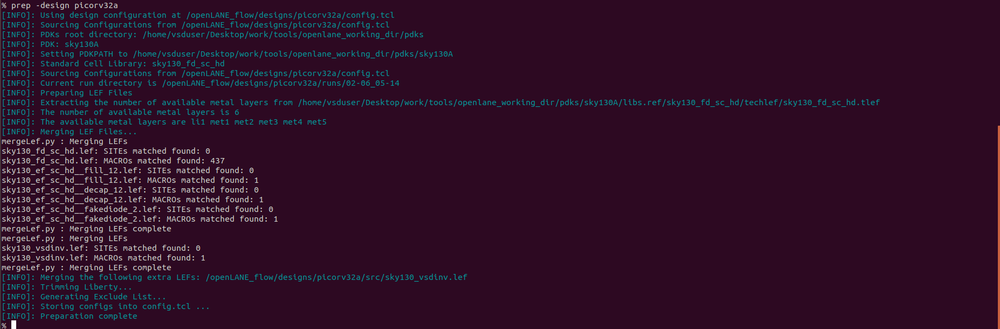

# **Advance Physical Design using OpenLANE and SkyWater 130nm PDK**

## **Day 1**
-Introduction to IC Design components and terminologies:
- Core- A core is an area in the chip where the fundamental logic of the design is placed. It encapsulates all the combinational circuit, soft and hard IPs, and nets.
- Die- Die is an area of chip that encapsulates the core and IO pads. Die is imprinted multiple times along the silicon area or wafer to increase the throughput.
- IO pads- IO pads are the pins that act as the source of communication between core and the outside world. Pad cells surround the rectangular metal patches where external bonds are made. input,output and power pad.

- IPs- Foundary IPs are manually designed or need some human interference (or intelligence) essentially to define and create them like SRAM, ADC, DAC, PLLs.
- PDKs- PDKs are interface between foundary and design engineers. PDKs contains set of files to model fabrication process for the design tools used to design IC like device models, DRC, LVS, Physical extraction, layers, LEF, standard cell libraries, timing libraries etc. SkyWater 130nm is the PDK used in this workshop specifically sky130_fd_sc_hd and openLANE is built around this PDK.

-Software application to hardware execution:
Applications and softwares running on like PCs and laptops are implemented in languages like C, C++, Python, Java, .NET etc.These applications needs to be converted to bitstream using the compiler and assembler which is understandable the core. Compilers are used for this purpose which generates bitstream based on Instruction set architecture of the native processor. The core is implemented using HDL.

-RTL2GDS OpenLANE ASIC Flow:
OpenLANE is an automated RTL to GDSII flow. It is based on several open source components including OpenROAD, Yosys, Magic, Netgen, Fault, OpenPhySyn, CVC, SPEF-Extractor, CU-GR, Klayout and custom methodology scripts for design exploration and optimization.

- OpenLANE is run as an container inside docker.
For OpenLANE setup refer :
https://github.com/The-OpenROAD-Project/OpenLane[`*OpenLANE*`]

-Open source EDA tools familiarisation:
To run in interactive mode(Step by step mode)

To import and check whether OpenLANE package is installed

To prepare and setup the design

Preparation step basically sets up the directory structure, merges the technology LEF (.tlef) and cell LEF(.lef) into one. Tech LEF contains the layer informations and cell LEF contains the cell informations. All the designs are placed under the designs directory for openLANE flow. Directory structure of picrorv32a before and after executing prep command.

src- Contains verilog files and constraints file
config.tcl- Contains the configurations used by OpenLANE

There are three configuration files:
- Each phase used in the process flow has a configuration tcl file under openlane_working_dir/openlane/configuration/<phase_name>.tcl
- Each design will have its own config.tcl file
- Each design will have its own pdk specific tcl file, sky130A_sky130_fd_sc_hd_config.tcl which has the highest precedence.

OpenLANE tools configuration files:

To synthesize the design:
yosys- Performs RTL synthesis
abc- Performs technology mapping
OpenSTA- Performs static timing analysis on the resulting netlist to generate timing reports

### **Day 2**
-Chip Floorplanning:
In floorplanning phase deals with setting die area, core area, core utilization factor, aspect ratio, placing of macros, power distribution networks and placement of IO pins.
* Aspect Ratio- Specifies the shape of the chip, given by ratio of height to width of the core area. Aspect ratio of 1 indicates square shape else rectangle.
* Utilization Factor- Specifies the amount of area taken by the netlist, given by ratio of area of netlist to area of the core. For placement optimization and realizable routing utilization factor is kept to 0.5 to 0.7 range.
* Pre-placed Cells- Preplaced cells have fixed location on the chip and cannot be moved around in placement phase. The placement of these macros are considered while deciding the placement of standard cells by floor planning tools.Macros can be used several times in a design. Typical examples of macros are memory blocks, clock gating cells, comparators etc.
* Decoupling Capacitors- Decaps are used with preplaced cells to compensate the voltage drop along the long wires and nets which affects the noise margin. Decaps are charged to the supply voltage and used as the supply source for the logic level transitions LOW to HIGH. It decouples the circuit from main supply.
* Power Planning- Power planning means to provide power to the every macros, standard cells, and all other cells are present in the design.Power planning is a step which typically is done with floor planning in which power grid network is created to distribute power to each part of the design equally to mitigate voltage droop and ground bounce issues. In openLANE flow, PDN is done before routing phase.
* Pin Placement- Pins placement also done in floor planning phase and logical cell placement blockage is added to prevent PnR tools from adding cells in this region.
* Floor Planning- To run floorplanning phase.

Floor planning phase generate DEF file which contains core area and placement details of standard cells.
DEF file generated by floorplan phase can be utilized by magic tool to get the floorplan view which requires 3 configuration files:
* Magic technology file (sky130A.tech)
* DEF file from floorplan phase
* Merged LEF file from preparation phase

-Placement:
Placement determine the locations of standard cells or logic elements within each block.Some circuit elements may have fixed locations while others are movable.
* Global Placement- Global placement assigns general locations to movable objects. Some overlaps are allowed between placed objects.
* Detailed Placement- Detailed placement refines object locations to legal cell sites and enforces non-overlapping constraints. Detailed placement determines the achievable quality of the subsequent routing stages.
To run placement phase

DEF file generated by placement phase can be utilized by magic tool to get the placement view which requires 3 configuration files:
* Magic technology file (sky130A.tech)
* DEF file from placement phase
* Merged LEF file from preparation phase

-Standard Cell Design:
Standard cell design flow consists of 3 stages
* Inputs- PDKs, DRC and LVS rules, SPICE models, library & user-defined specs.
* Design Steps- Involves circuit design, layout design, characterization using GUNA tool. Characterization involves timing, power and noise characterizations.
* Outputs- CDL (Circuit Description Language), GDSII, LEF(Library Exchange Format), Spice extracted netlist, timing, noise, power libs.

-Standard Cell Characterization:
Standard cell characterization refers to gathering data about the behaviour of standard cells. To build the circuit knowledge of logic function of cell alone is not sufficient. Standard cell library has cells with different drive strength and functionalities.These cells are characterized by using tool like GUNA.
The standard cell characterization flow involves:
* Read the model files
* Read the extracted spice netlist
* Recognize function or behaviour of the cell
* Apply stimulus and characterization setup
* Vary the output load capacitance and observe the different characterization behaviours
* Provide necessary simulation commands
Apply the entire flow to GUNA tool to generate timing, noise and power models.

#### **Day 3**
